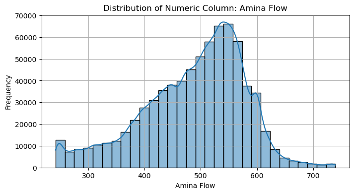

# Mining Process - Advanced Data Analysis and Machine Learning 
### Group project: Level A2 (30p) Future predictions of silica content
### Team members: Maksim Kovalevskii, Emilie Ledoussal, Jakob Pflugbeil 

**Report 1: Data summary and visualization** 

*Date: 14-09-2025*
## Group communication and code sharing strategy
- We created a group chat in Microsoft Teams for easy and efficient communication. Moreover, we all work in Lahti Campus - here we schedule small meetings for discussing the problem, determining goals and estimating workload. 
- We created a [project repository in Github](https://github.com/EmiliLed/Advanced-Data-Analysis-Mining-Project) for sharing the code and tracking the progress and solving possible issues together. 

## Data initial description. Importing data & Observed challenges
*Original description*: The dataset originates from a mining process, from the froth flotation phase. The process is successful if there is as little outlet silica content as possible. There are 24 variables (columns) in the data. The first column shows time and date range (from March of 2017 until September of 2017). Some columns were sampled every 20 seconds. Others were sampled on an hourly basis. The second and third columns are quality measures of the iron ore pulp right before it is fed into the flotation plant. Column 4 until column 8 are the most important variables that impact on the ore quality at the end of the process. From column 9 until column 22, we can see process data (level and air flow inside the flotation columns, which also impact in ore quality. The last two columns are the final iron ore pulp quality measurement from the lab. Target is to predict the last column, which is the % of silica in the iron ore concentrate.

*Our observations*: Initial .csv database was uploaded and analyzed via Python (polished_up_data_analysing.py). There are 737453 rows (observations) x 24 columns(variables). The data is discontinuous from 2017-03-16 06:00:00 until 2017-03-29 12:00:00 in the total time span 2017-03-10 01:00:00 to 2017-09-09 23:00:00. There are 180 observations per hour if data is present. Data for variables 2 (*Iron conc. In feed [%]*) and 3 (*Silica conc. In feed [%]*) change daily at 7:00,16:00, 1:00 (only 3 unique values per day). Variables 23 (*Outlet iron conc. [%]*) and 24 (*Outlet silica conc. [%]*) are taken hourly. In addition to discontinuity in the database, there are over 100000 observations where data for Variables 2, 3 (*Iron & Silica conc. In feed [%]*) stay the same (see pictures in the next chapter). There are around 90000 observations in a row where sensors of Variables 12,13 (*Flotation column 4&5 air flow*) demonstrate the same value, which might be a sign of real data loss. 

## Visualization and comment on the dataset
![Variable 2 (Iron conc. In feed [%]) distribution](Images/Var2Iron.png) 
 

Due to the challenges discussed, distribution of variables 2,3 tends to be Gaussian with unexpected peaks in the end (var. 2) and beginning (var.3) of the values range. Impactful variables 4-7 seem not to have problems in the values distribution. Impactful variable 8 (*Ore pulp density*) as well as variable 12 has a suspicious peak in the beginning of the range, variable 13 – in the end of the range. 

## Data Analysis with PCA
PCA was implemented via Python (PCA.py). Number of principal components to reach 95% explained variance is 16 with RMSE equal to 0.045.
**Biplots?? explain variable correlations and visualize the PCs using biplots, loading plots DON’T KNOW WHAT TO WRITE HERE**

![Variable 3 (Silica conc. In feed [%]) - Original and Reconstructed data](Images/pcavar3.png)

Variable 3 (Silica conc. In feed [%]) - Original and Reconstructed data

## Data pretreatment plan
We plan to implement 2 main strategies and compare further results
1.	Eliminating rows of the data matrix (observations), where variables 2,3,12 and 13 stay unchanged and analyze data with PCA again. Compare changes in results with the case of eliminating only samples where variables 2,3 seem suspicious (as they are more impactful than 12 and 13)
2.	Different variables are sampled differently – every 20 seconds, hourly or 3 times a day. Our second hypothesis is to reduce the initial matrix size by using mean daily and/or hourly data. We expect that combining strategy 2 with the strategy 1 could provide us with cleaner data and reduce the storage at the same time. 

## References
[Quality Prediction in a Mining Process](https://www.kaggle.com/datasets/edumagalhaes/quality-prediction-in-a-mining-process/data)
